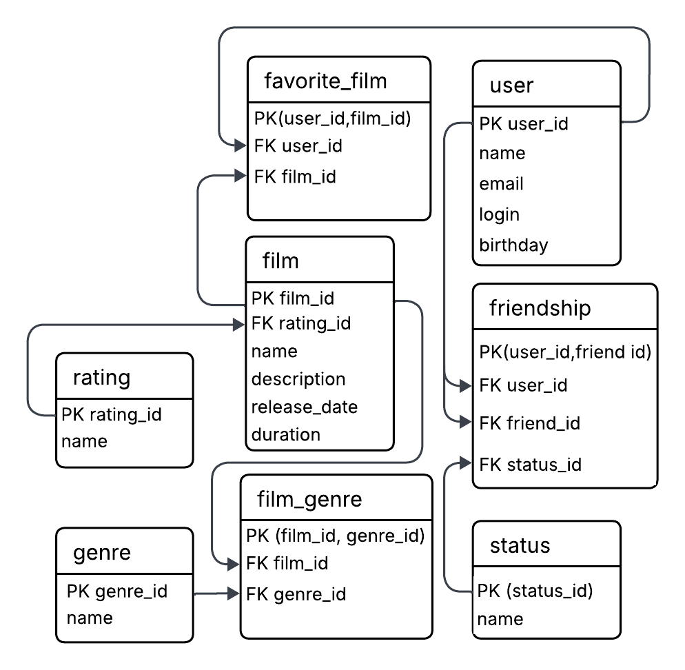

# java-filmorate
***Схема базы данных***

***Примеры запросов:***

Получение списка фильмов с их рейтингами.
```sql
SELECT f.name, f.description, r.name AS rating_name
FROM film f
JOIN rating r USING (rating_id);
```
Поиск всех фильмов в жанре "Мульфильм".
```sql
SELECT f.name
FROM film f
JOIN film_genre fg USING (film_id)
JOIN genre g USING (genre_id)
WHERE g.name = 'CARTOON';
```
Список любимых фильмов конкретного пользователя.
```sql
SELECT f.name, f.release_date
FROM film f
JOIN favorite_film ff USING (film_id)
WHERE ff.user_id = 1;
```
Проверка статуса дружбы между пользователями
```sql
SELECT u.name, s.name AS status
FROM friendship fr
JOIN user u ON fr.friend_id = u.user_id
JOIN status s USING (status_id)
WHERE fr.user_id = 1;
```
Получение списка жанров для конкретного фильма
```sql
SELECT g.name
FROM genre g
JOIN film_genre USING (genre_id)
WHERE film_id = 1;
```